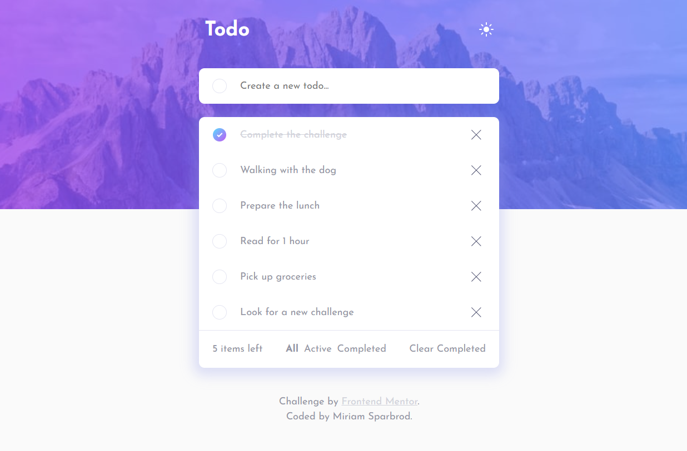
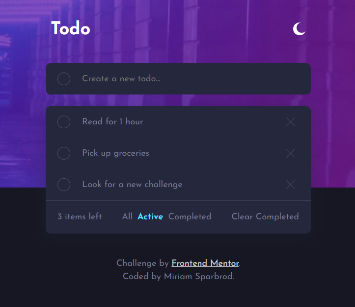
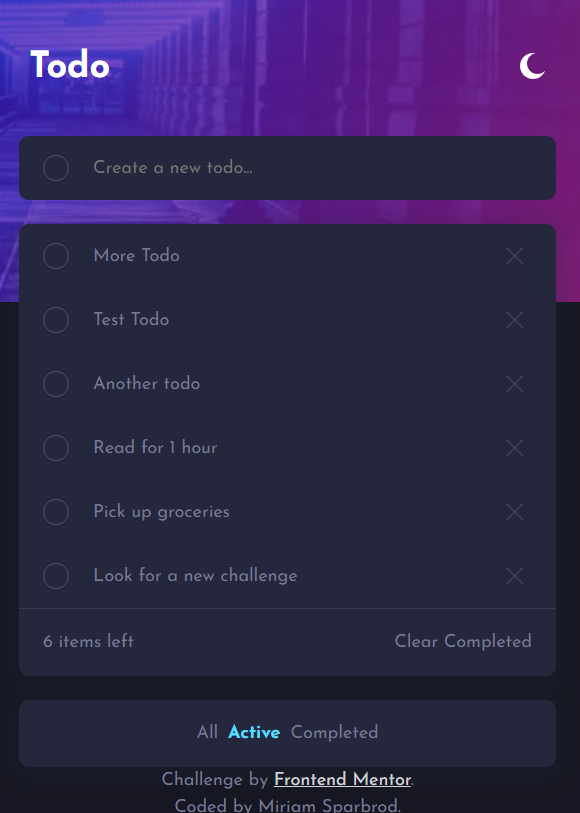

# Todo App

# Screenshots - App-Overview

## Overview

This Todo App is a minimalist and intuitive web application designed to help users manage their daily tasks with ease. Built using React, it offers features such as task addition, task completion toggling, filtering tasks by status, and a light/dark theme toggle for a personalized user experience.

## Technology Stack

- **React**: Utilizes React functional components and hooks for state management and lifecycle events, providing a responsive and interactive user interface.
- **CSS**: Custom stylesheets are used to enhance the UI and provide a seamless user experience across Desktop-Screen and Mobile devices.
- **react-beautiful-dnd**: Implements drag-and-drop functionality for task reordering within the list.

## Features

### Task Management

- **Add Tasks**: Users can add new tasks to their list, each with a unique identifier and a completion status.
- **Toggle Task Completion**: Each task's completion status can be toggled to reflect its current state.
- **Delete Tasks**: Users have the option to remove tasks from the list.

### Task Reordering with Drag and Drop

- **Drag and Drop**: Tasks can be easily reordered within the list by dragging and dropping them to a new position.

### Filtering

- **Task Filtering**: Tasks can be filtered based on their completion status, allowing users to focus on active or completed tasks as needed.

### Themes

- **Light/Dark Theme Toggle**: Supports light and dark themes, allowing users to choose their preferred visual mode for enhanced accessibility and user comfort.

## Components

### `App.js`

- The root component that orchestrates the application, managing the main state, including the todo list, theme preference, and filter status.

### `Header.js`

- Displays the application's header with a theme toggle switch.

### `TodoForm.js`

- A form component that allows users to input and submit new tasks.

### `TodoList.js`

- Renders the list of tasks based on the active filter status, handling task deletion and providing a count of remaining tasks.

### `Footer.js`

- Presents the footer of the application, typically containing authorship or credit information.

## Getting Started

To run this application locally:

1. Clone the repository to your local machine.
2. Install the dependencies by running `npm install` in the project directory.
3. Start the application with `npm start`. The app will be available at `http://localhost:3000`.

## Contributing

Contributions to improve the app are welcome. Please feel free to fork the repository and submit pull requests with your enhancements.

## License

This project is open-sourced under the MIT license.
This is a solution to the [Todo app challenge on Frontend Mentor](https://www.frontendmentor.io/challenges/todo-app-Su1_KokOW).
